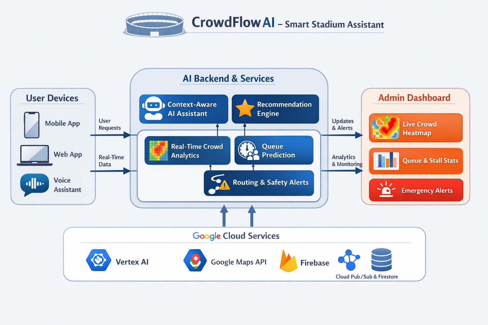

# 🏟️ CrowdFlow AI: Intelligent Stadium Orchestration Platform

[](https://nextjs.org/)
[](https://fastapi.tiangolo.com/)
[](https://cloud.google.com/vertex-ai)
[](https://firebase.google.com/)

---

## 🌍 Problem Statement

Large-scale sporting venues face critical challenges:

* 🚶‍♂️ Crowd congestion leading to safety risks
* ⏳ Long waiting times at food stalls and entry gates
* 📍 Poor navigation inside complex stadium layouts
* 📢 Lack of real-time coordination between systems

Traditional systems are:

> static, reactive, and fragmented

---

## 💡 Solution: CrowdFlow AI

**CrowdFlow AI** is a **real-time, AI-powered orchestration platform** that:

* Monitors live stadium conditions
* Predicts and optimizes crowd movement
* Provides intelligent, context-aware recommendations
* Enables seamless navigation and decision-making

---

## 🧠 Core System Capabilities

### 📡 1. Real-Time Crowd Intelligence

* Live density tracking via Firestore streams
* Dynamic heatmap visualization
* Zone-based congestion detection

### ⏱️ 2. Queue Prediction Engine

* Real-time wait-time estimation
* Service rate modeling
* Fastest option recommendation

### 🧭 3. Smart Routing System

* Crowd-aware navigation
* Dynamic path optimization
* Integration-ready with Google Maps APIs

### 🤖 4. AI Decision Agent (Vertex AI)

* Powered by **Gemini 1.5 Flash**
* Natural language understanding
* Tool-based function calling:

  * fetch crowd data
  * compute best route
  * evaluate queues
  * generate recommendations

---

## 🧠 How the AI Agent Works

1. User query → sent to Vertex AI
2. LLM analyzes intent
3. Selects appropriate tool (function calling)
4. Backend executes tool
5. AI returns contextual response

👉 This is a **true agentic AI system**, not rule-based logic.

---

## ⚡ Real-Time Architecture

The system follows a real-time, event-driven architecture where live stadium data flows seamlessly through Firebase and is processed by AI-driven backend services.

<p align="center">
  
</p>

### 🔄 Data Flow Explanation

1. **User Devices**

   * Mobile, Web, and Voice interfaces send user queries and receive updates

2. **AI Backend & Services**

   * Context-aware AI assistant processes requests
   * Recommendation engine provides intelligent suggestions
   * Crowd analytics + queue prediction + routing logic operate in real-time

3. **Google Cloud Services**

   * Firebase provides real-time data streaming
   * Vertex AI powers intelligent decision-making
   * Google Maps enables routing and navigation

4. **Admin Dashboard**

   * Monitors live crowd heatmaps
   * Tracks queue statistics
   * Handles emergency alerts

---

### ⚡ Key System Properties

* 🔄 Real-time updates via Firestore listeners
* 🧠 AI-driven decision making using Vertex AI
* 📡 Event-driven architecture
* ☁️ Fully scalable on Google Cloud

---

## 🛠️ Detailed Tech Stack

### Frontend

* Next.js 16 (App Router)
* Tailwind CSS v4 (modern UI)
* Firebase Web SDK (real-time listeners)
* React Hooks + Context API

### Backend

* FastAPI (async APIs)
* Domain-driven architecture
* Dependency injection pattern

### AI Layer

* Vertex AI (Gemini 1.5 Flash)
* Function calling architecture
* Context-aware decision system

### Data Layer

* Firestore (real-time NoSQL)
* Structured collections:

  * crowd
  * queue
  * routing nodes

---

## 📊 Feature Breakdown

| Feature            | Type        | Status          |
| ------------------ | ----------- | --------------- |
| Crowd Heatmap      | Real-time   | ✅               |
| Queue Prediction   | Dynamic     | ✅               |
| Routing Engine     | Hybrid      | ⚠️ (expandable) |
| AI Assistant       | LLM-powered | ✅               |
| Firebase Streaming | Real-time   | ✅               |

---

## 🎨 UI/UX Highlights

* 🌙 Dark-mode glassmorphism design
* ⚡ Real-time visual updates
* 🧠 AI chat interface
* 📊 Interactive dashboards
* 📱 Responsive layout

---

## 🧪 Testing & Validation

* API tested via Swagger (`/docs`)
* Integration tested:

  * Firebase live updates
  * Vertex AI responses
* Manual simulation:

  * dynamic crowd updates
  * queue fluctuations

---

## 🚀 Getting Started

### Backend

```bash
cd backend
python -m venv venv
source venv/bin/activate
pip install -r requirements.txt
cp .env.example .env
uvicorn app.main:app --reload
```

---

### Frontend

```bash
cd frontend
npm install
cp .env.example .env.local
npm run dev
```

---

### Docker (Full System)

```bash
docker-compose up --build
```
---

## 🧠 Future Enhancements

* 🔮 Predictive crowd movement (ML models)
* 🧑‍💻 Admin control dashboard
* 🎥 Computer vision for crowd density
* 🔊 Voice-based assistant
* 📡 IoT sensor integration

---


<p align="center">
  Built with ❤️ for Google PromptWars — CrowdFlow AI Team
</p>
